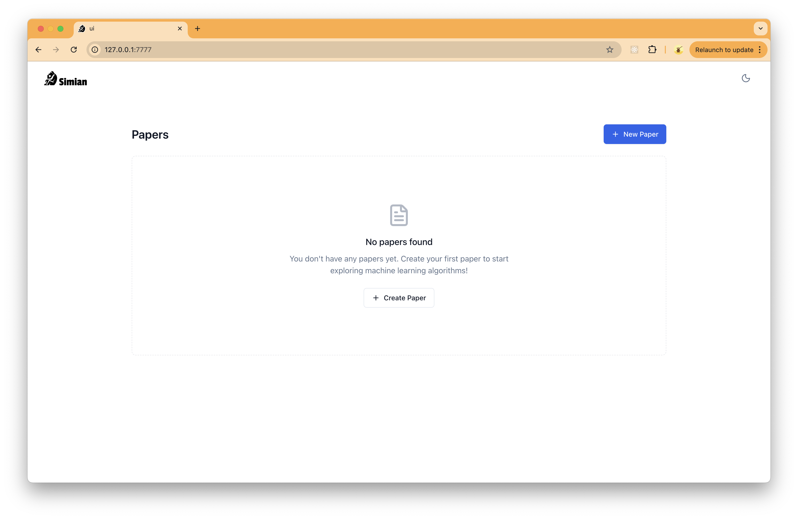
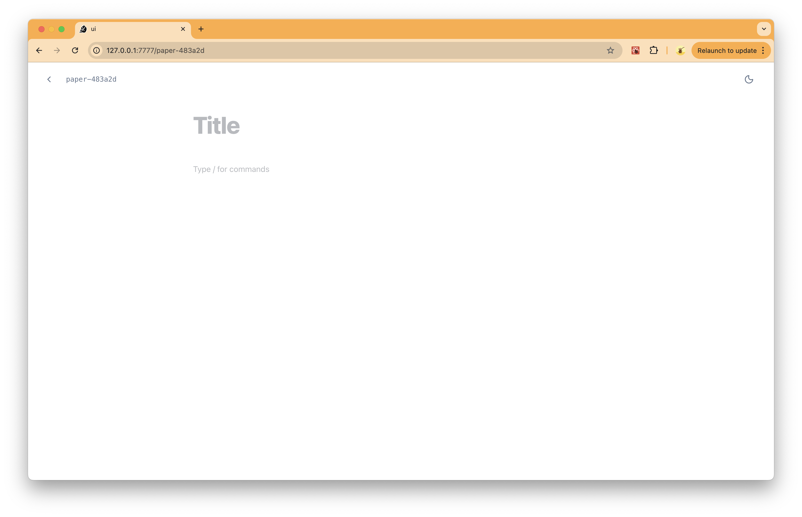
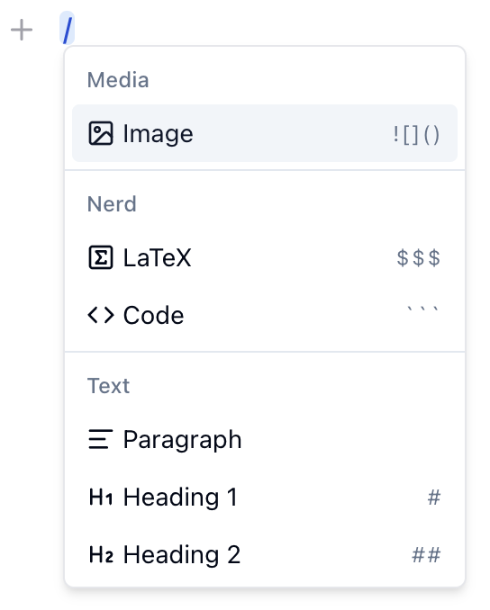
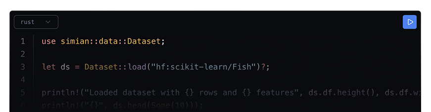

# Paper: Simian Paper

## Simian Paper

Simian papers are very similar to Jupyther Notebooks but better 😜. The idea is to create something like Notion but for science. Simian itself is a framework I've built to get my hands dirty with Machine Learning and Artificial Intelligence in general. Originally a paper was the UI I could use to get a better sense of the algorithms implemented in the Simian CLI but it can actually be used for anything actually. In the next sections I'm going to describe what are the blocks we can use to write papers in Simian and how we can publish them so everyone can share knowledge. 

## Installation

In order to create a paper you first need to install Simian CLI. As explained in GitHub this is as simple as running the following command in your terminal:

```bash
curl -fsSL https://simian.sh/install.sh | bash
```

You can test if it got correctly installed by checking its version with the following:

```bash
simian --version
```

If you see an output showing the current simian version then you are ready to open a the paper UI by running the following:

```bash
simian paper open
```


This will open the paper index page listing all papers you have created and a button so you can create a new paper.




Go ahead and click that "New Paper" button so you get redirected to the new paper editor where you can see an empty title and an empty paragraph like this:




You can get back to the index page (the papers list page) by clicking on the left arrow icon we have on the top left of the page.

## The Editor

Our Simian editor is built on top of the excellent SlateJS editor and is what you use to write papers. It is a block based editor where we stack different types of blocks together. Right now we support a title, heading, paragraph, code, latex and image blocks. It also supports inline elements like bold, italic and underline texts or links, codes and more to come. We are trying to support markdown shortcuts for all those blocks and inline elements so in theory you can type # at the begining of a paragraph to convert it to an H1 block as we normally do in markdown. Not all the things are supported yet but I'm working hard to improve the editor and you can definitely contribute!

## Commands Menu




At any time you can hit  / in a paragraph to open the commands menu where you can see all the available blocks you can use. On the right side of the the block item in the dropdown you can see the markdown shortcut you can use in the text to create that block. For example, to start a new code block you can simply type ``` at the beginning of a new paragraph.

To apply inline style or elements you can select any piece of text to automatically open the inline menu on top of the selection. 

## Title

Every paper must have a title and when you hover over the title block you are going to see a "return arrow" button on the left of it. You can use this button to add an optional subtitle to your paper. The title you add is going to be the one we suggest when you submit your paper but you can optionally use another name on submission time. More on paper submissions below.

## Heading

The headings act like section titles throughout the paper and we support 6 different levels of headings we call H1, ..., H6. An Hk heading can be created from the commands menu or also by typing # k times in the beginning of a paragraph and then hitting space. This will convert the whole paragraph into a Hk heading. 

## Paragraph

I probably don't need to describe what a paragraph is right? 😂

## Code Block

A code block is where you write some piece of code and, as we mentioned before, you can create such a block either from the commands menu or by typing ``` directly in the beginning of an empty paragraph and then hitting space.

At the top left of the code block you are going to see the code language selector and on the top right we will display a "play" button so you can actually run the code contained in the block. Right now we only support running Rust code and only while writing a paper. This way you can use the Simian Rust library directly in a paper code block so you can visualize data loaded from multiple sources, plot charts, train models and whatnot. Maybe in the future we could support executing code written in languages other than Rust but for now we focused in Rust because Simian CLI itself is written in Rust. 




The way we run Rust code is basically the following: we grab the code from all the Rust code blocks that happens before the target code block (i.e., the one we are running), join all those codes together, compile them and execute them. We try to cache as much as possible to make this process as fast as possible and so far it is working fine (at least for the small papers I'm working on). One challenge of this approach is how we pick up the correct output from all outputs to present as the output of the target block. Right now we do a hacky solution by injecting some "prints" in the joined code to split the output into sections associated with each code block. Maybe we could explore better ways of executing code in Simian papers. Feel free to suggest something in our Discussion page in GitHub. I would love to hear your ideas 😁♥️

## LaTeX Block

You can add math formulas by writing LaTeX expression both inline and in a block. To add inline LaTeX expressions you should wrap the expression around $ (e.g., $\int_{a}^{b} f(x) \, dx = C$) and to add a LaTeX block you can use both the commands menu or type $$$ in the beginning of an empty paragraph. The LaTeX block is similar to a code block where you can write LaTeX code (expression) and as soon as you are finish with writing the expression you can hit Shift+Enter to switch the block to read mode which makes the expression to be rendered as a nice math formula. Double clicking on the LaTeX block will switch it back to write mode so you can edit the underlying LaTeX expression. Here is an example of rendered LaTeX expression:

$$
\int_{-\infty}^{\infty} e^{-x^2} \, dx = \sqrt{\pi}
$$


As you can see a rendered LaTeX expression has an identification number on its right side and in the future we are going to allow referencing that expression through the editor (this is not done yet).

## Image Block

Last but not least is the image block you can use to display an image in the editor. The image block is a powerful element which allows you to display one or multiple images together. Up to 4 items the image block is going to present each image in a nice grid like this: 


When you click on a specific image in this grid it gets focused and is expanded to fulfill the grid area. When this happens you can add a caption specific to that focused image. You can also add a global caption applied to whole grid when no image is focused. Finally, you can drag images around to reposition them inside the grid if you wish, resize the image block to predefined sizes (standard, wide and full) or using the left/right resize bars and also make the image block to float left/right so it gets surrounded by text.

## Submission

You can submit your paper to be peer reviewed by the Simian community and after approved your paper will be publically accessible at https://papers.simian.sh/<your-paper-id>. To submit a paper you should run:

```bash
simian paper submit your-paper-id
```

A couple of questions are going to be asked (like if you want to specify co-authors or change the paper id) and after that a Pull Request (PR) is going to be created in our Simian Papers repository. A pure markdown version of your paper is going to be generated and reviewed by at least one automatically assigned reviewer.

You can preview how your paper is going to look like when published by using the preview command:

```bash
simian paper preview your-paper-id
```

This command will build up your paper the same way submit will do and serve it locally so we can preview it. It also mocks some approvers, submit date and multiple versions so you have some idea of how the paper will really look like.

